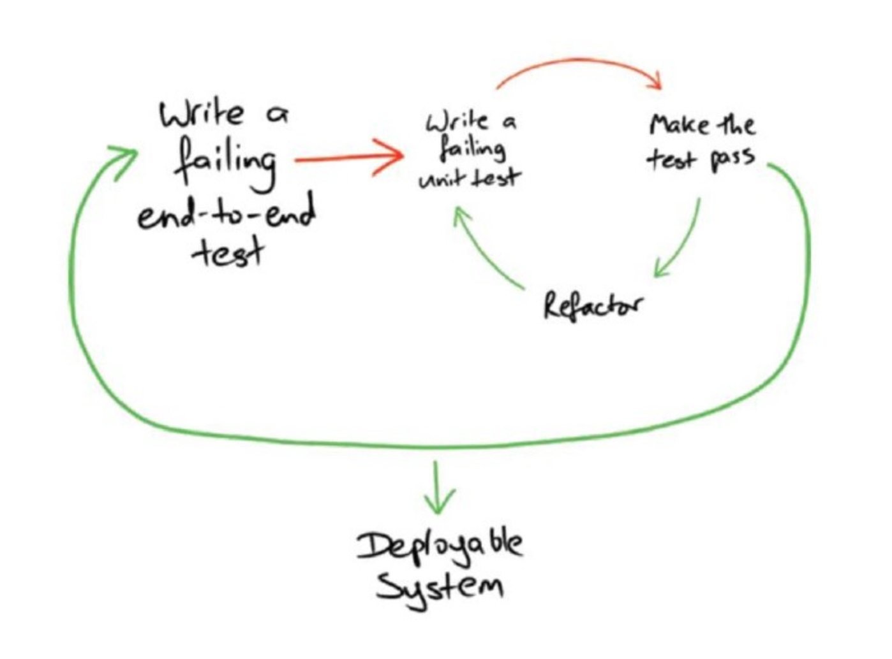
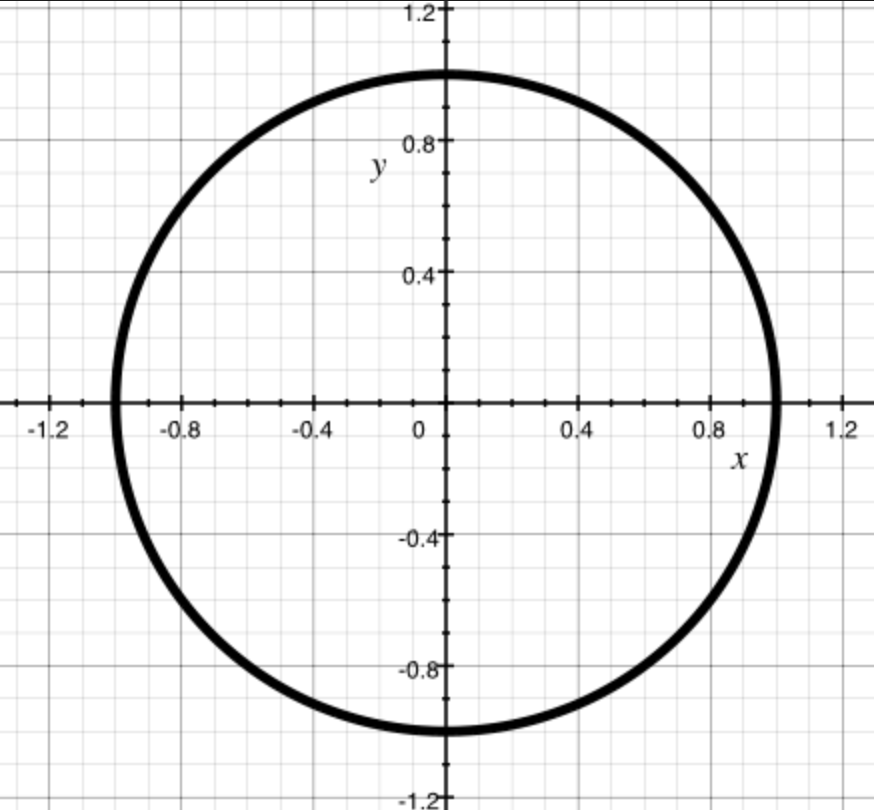
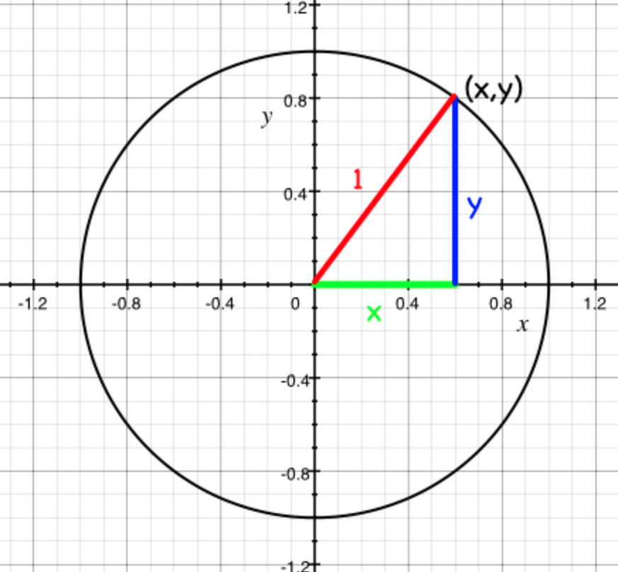
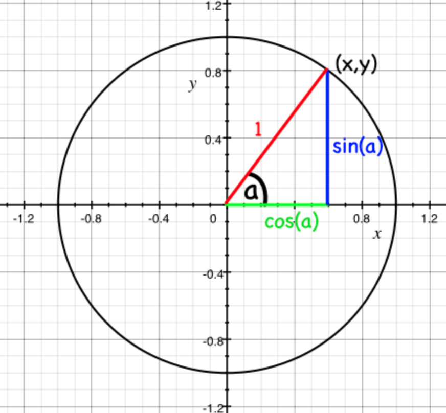
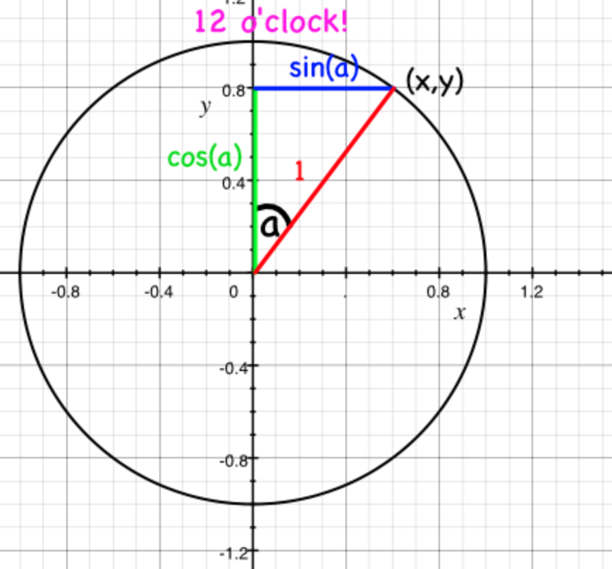
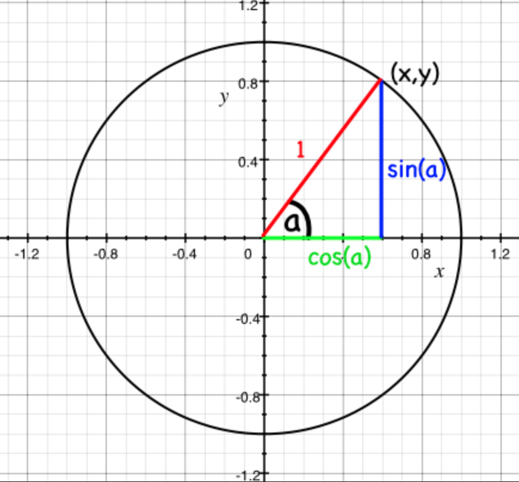
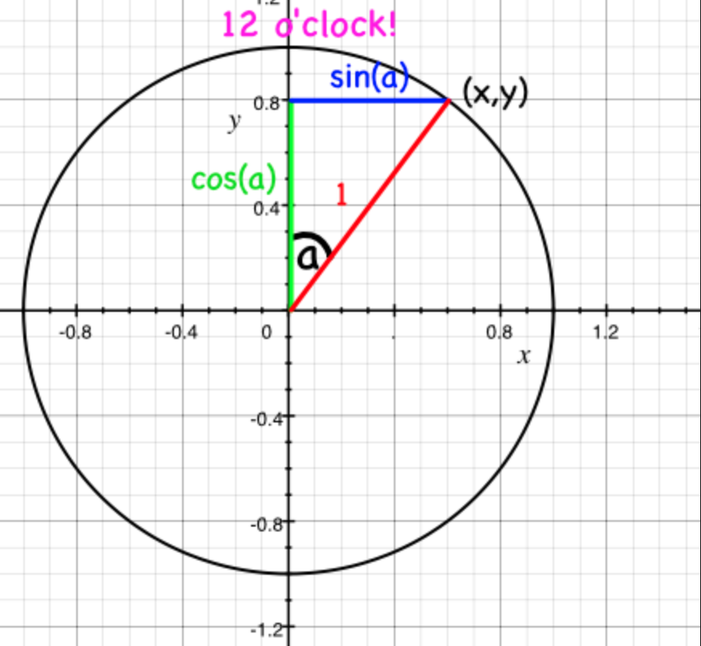

# Math

You can find all the code for this chapter [here](https://github.com/PeppyDays/learn-rust-with-tests/tree/main/examples/math).

For all the power of modern computers to perform huge sums at lightning speed, the average developer rarely uses any mathematics to do their job. But not today! Today we'll use mathematics to solve a real problem. And not boring mathematics - we're going to use trigonometry and vectors and all sorts of stuff that you always said you'd never have to use after highschool.

## The Problem

You want to make an SVG of a clock. Not a digital clock - no, that would be easy - an analogue clock, with hands. You're not looking for anything fancy, just a nice function that takes a time and spits out an SVG of a clock with all the hands - hour, minute and second - pointing in the right direction. How hard can that be?

First we're going to need an SVG of a clock for us to play with. SVGs are a fantastic image format to manipulate programmatically because they're written as a series of shapes, described in XML. So this clock is described like this:

```xml
<?xml version="1.0" encoding="UTF-8" standalone="no"?>
<!DOCTYPE svg PUBLIC "-//W3C//DTD SVG 1.1//EN" "http://www.w3.org/Graphics/SVG/1.1/DTD/svg11.dtd">
<svg xmlns="http://www.w3.org/2000/svg"
     width="100%"
     height="100%"
     viewBox="0 0 300 300"
     version="2.0">

  <!-- bezel -->
  <circle cx="150" cy="150" r="100" style="fill:#fff;stroke:#000;stroke-width:5px;"/>

  <!-- hour hand -->
  <line x1="150" y1="150" x2="114.150000" y2="132.260000"
        style="fill:none;stroke:#000;stroke-width:7px;"/>

  <!-- minute hand -->
  <line x1="150" y1="150" x2="101.290000" y2="99.730000"
        style="fill:none;stroke:#000;stroke-width:7px;"/>

  <!-- second hand -->
  <line x1="150" y1="150" x2="77.190000" y2="202.900000"
        style="fill:none;stroke:#f00;stroke-width:3px;"/>
</svg>
```

It's a circle with three lines, each of the lines starting in the middle of the circle (x=150, y=150), and ending some distance away.

So what we're going to do is reconstruct the above somehow, but change the lines so they point in the appropriate directions for a given time.

## Acceptance Test

Before we get too stuck in, lets think about an acceptance test.

Wait, you don't know what an acceptance test is yet. Look, let me try to explain.

Let me ask you: what does winning look like? How do we know we've finished work? TDD provides a good way of knowing when you've finished: when the test passes. Sometimes it's nice - actually, almost all of the time it's nice - to write a test that tells you when you've finished writing the whole usable feature. Not just a test that tells you that a particular function is working in the way you expect, but a test that tells you that the whole thing you're trying to achieve - the 'feature' - is complete.

These tests are sometimes called acceptance tests, sometimes called feature tests. The idea is that you write a really high level test to describe what you're trying to achieve - a user clicks a button on a website, and they see a complete list of the Pokémon they've caught, for instance. When we've written that test, we can then write more tests - unit tests - that build towards a working system that will pass the acceptance test. So for our example these tests might be about rendering a webpage with a button, testing route handlers on a web server, performing database look ups, etc. All of these things will be TDD'd, and all of them will go towards making the original acceptance test pass.

Something like this classic picture by Nat Pryce and Steve Freeman.



Anyway, let's try and write that acceptance test - the one that will let us know when we're done.

We've got an example clock, so let's think about what the important parameters are going to be.

```xml
<line x1="150" y1="150" x2="114.150000" y2="132.260000"
        style="fill:none;stroke:#000;stroke-width:7px;"/>
```

The centre of the clock (the attributes `x1` and `y1` for this line) is the same for each hand of the clock. The numbers that need to change for each hand of the clock - the parameters to whatever builds the SVG - are the `x2` and `y2` attributes. We'll need an `X` and a `Y` for each of the hands of the clock.

I could think about more parameters - the radius of the clockface circle, the size of the SVG, the colours of the hands, their shape, etc... but it's better to start off by solving a simple, concrete problem with a simple, concrete solution, and then to start adding parameters to make it generalised.

So we'll say that:

- Every clock has a centre of (150, 150)
- The hour hand is 50 long
- The minute hand is 80 long
- The second hand is 90 long

A thing to note about SVGs: the origin - point (0,0) - is at the top left hand corner, not the bottom left as we might expect. It'll be important to remember this when we're working out where what numbers to plug in to our lines.

Finally, I'm not deciding how to construct the SVG - we could use a template or we could just write bytes. But we know we'll need those numbers, so let's focus on testing something that creates them.

## The First Requirement: The Second Hand of Midnight

Before starting, let's add some crates to our project. We need `chrono` to work with times, and `fake` to generate random times for our tests. We'll also use `rstest` for parameterised tests.

```toml
[dependencies]
chrono = "0.4"

[dev-dependencies]
fake = { version = "4", features = ["chrono"] }
rstest = "0.25"
```

### Write the Test First

So my first test looks like this:

```rust
#[cfg(test)]
mod specs_for_clockface {
    use chrono::NaiveTime;

    use super::ClockFace;
    use super::Point;

    #[test]
    fn sut_indicates_second_hand_correctly_when_midnight() {
        // Arrange
        let time = NaiveTime::from_hms_opt(0, 0, 0).unwrap();

        // Act
        let actual = ClockFace::from(time).second_hand();

        // Assert
        let expected = Point::new(150.0, 150.0 - 90.0);
        assert_eq!(expected, actual);
    }
}
```

Remember how SVGs plot their coordinates from the top left hand corner? To place the second hand at midnight we expect that it hasn't moved from the centre of the clockface on the X axis - still 150 - and the Y axis is the length of the hand up from the centre; 150 minus 90.

### Try to Run the Test

This drives out the expected failures around the missing `ClockFace` and `Point` types, and the `from` method on `ClockFace`.

### Write the Minimal Amount of Code

Let's implement those types to get the code to compile:

```rust
use chrono::NaiveDateTime;

#[derive(Debug, PartialEq)]
pub struct Point {
    pub x: f64,
    pub y: f64,
}

impl Point {
    pub fn new(x: f64, y: f64) -> Self {
        Self { x, y }
    }
}

#[derive(Debug)]
pub struct ClockFace;

impl ClockFace {
    pub fn second_hand(&self) -> Point {
        Point::new(0.0, 0.0)
    }
}

impl From<NaiveTime> for ClockFace {
    fn from(time: NaiveTime) -> Self {
        ClockFace
    }
}
```

And now we get:

```bash
thread 'v1::specs_for_clockface::sut_indicates_second_hand_correctly_when_midnight' panicked at src/v1.rs:51:9:
assertion `left == right` failed
  left: Point { x: 150.0, y: 60.0 }
  right: Point { x: 0.0, y: 0.0 }
```

### Write Enough Code to Make It Pass

When we get the expected failure, we can fill in the return value of second hand:

```rust
impl ClockFace {
    pub fn second_hand(&self) -> Point {
        Point::new(150.0, 60.0)
    }
}
```

Behold, a passing test.

```bash
Nextest run ID 1abf9d8e-2756-44db-aa9a-64b61ab9bf08 with nextest profile: default
  Starting 1 test across 1 binary (1 test skipped)
      PASS [   0.003s] clock v1::specs_for_clockface::sut_indicates_second_hand_correctly_when_midnight
```

### Refactor

No need to refactor yet - there's barely enough code!

## The Second Requirement: The Second Hand of Thirty Seconds Past Midnight

We probably need to do some work here that doesn't just involve returning a clock that shows midnight for every time.

### Write the Test First

```rust
#[test]
fn sut_indicates_second_hand_correctly_when_thirty_seconds_past_midnight() {
    // Arrange
    let time = NaiveTime::from_hms_opt(0, 0, 30).unwrap();

    // Act
    let actual = ClockFace::from(time).second_hand();

    // Assert
    let expected = Point::new(150.0, 150.0 + 90.0);
    assert_eq!(expected, actual);
}
```

Same idea, but now the second hand is pointing downwards so we add the length to the Y axis. This will compile, but how do we make it pass?

### Thinking Time

How are we going to solve this problem?

Every minute the second hand goes through the same 60 states, pointing in 60 different directions. When it's 0 seconds it points to the top of the clockface, when it's 30 seconds it points to the bottom of the clockface. Easy enough.

So if I wanted to think about in what direction the second hand was pointing at, say, 37 seconds, I'd want the angle between 12 o'clock and 37/60ths around the circle. In degrees this is (360 / 60 ) \* 37 = 222, but it's easier just to remember that it's 37/60 of a complete rotation.

But the angle is only half the story; we need to know the X and Y coordinate that the tip of the second hand is pointing at. How can we work that out?

### Math

Imagine a circle with a radius of 1 drawn around the origin - the coordinate 0, 0.



This is called the 'unit circle' because the radius is 1 unit!

The circumference of the circle is made of points on the grid - more coordinates. The x and y components of each of these coordinates form a triangle, the hypotenuse of which is always 1 (i.e. the radius of the circle).



Now, trigonometry will let us work out the lengths of X and Y for each triangle if we know the angle they make with the origin. The X coordinate will be cos(a), and the Y coordinate will be sin(a), where a is the angle made between the line and the (positive) x axis.



If you don't believe this, go and look at [Wikipedia](https://en.wikipedia.org/wiki/Sine#Unit_circle_definition).

One final twist - because we want to measure the angle from 12 o'clock rather than from the X axis (3 o'clock), we need to swap the axis around; now x = sin(a) and y = cos(a).



So now we know how to get the angle of the second hand (1/60th of a circle for each second) and the X and Y coordinates. We'll need functions for both sin and cos.

Happily, Rust has a `f64` type that has `sin` and `cos` methods on it, so we can use those. If we look at the description of the `sin` and `cos` methods, we see that they take an angle in radians.

````rust
/// Computes the cosine of a number (in radians).
///
/// # Unspecified precision
///
/// The precision of this function is non-deterministic. This means it varies by platform, Rust version, and
/// can even differ within the same execution from one invocation to the next.
///
/// # Examples
///
/// ```
/// let x = 2.0 * std::f64::consts::PI;
///
/// let abs_difference = (x.cos() - 1.0).abs();
///
/// assert!(abs_difference < 1e-10);
/// ```
#[rustc_allow_incoherent_impl]
#[must_use = "method returns a new number and does not mutate the original value"]
#[stable(feature = "rust1", since = "1.0.0")]
#[inline]
pub fn cos(self) -> f64 {
    unsafe { intrinsics::cosf64(self) }
}
````

So what's a radian? Instead of defining the full turn of a circle to be made up of 360 degrees, we define a full turn as being 2π radians. There are good reasons to do this that we won't go in to.

Now that we've done some reading, some learning and some thinking, we can write our next test.

### Write the Test First

All this maths is hard and confusing. I'm not confident I understand what's going on - so let's write a test! We don't need to solve the whole problem in one go - let's start off with working out the correct angle, in radians, for the second hand at a particular time.

I'm going to comment out the acceptance test that I was working on while I'm working on these tests - I don't want to get distracted by that test while I'm getting this one to pass.

At the moment, our acceptance tests are in `lib.rs`. If you refer to [Test Organization](https://doc.rust-lang.org/stable/book/ch11-03-test-organization.html), you'll see that we can put our integration tests in a separate directory called `tests`. So let's create a new file in the `tests` directory as you wish and put our acceptance test there.

I created a file called `v2.rs` in the `tests` directory, and put the acceptance test there. The file looks like this:

```rust
use chrono::NaiveTime;

use clock::v2::ClockFace;
use clock::v2::Point;

#[test]
fn sut_indicates_second_hand_correctly_when_midnight() {
    // Arrange
    let time = NaiveTime::from_hms_opt(0, 0, 0).unwrap();

    // Act
    let actual = ClockFace::from(time).second_hand();

    // Assert
    let expected = Point::new(150.0, 150.0 - 90.0);
    assert_eq!(expected, actual);
}
```

After that, deleted the `specs_for_clockface` module in `lib.rs`.

Now, let's write the unit test in `lib.rs` for the angle of second hand at 30 seconds past midnight.

```rust
#[cfg(test)]
mod specs_for_seconds_in_radians {
    use std::f64::consts::PI;

    use chrono::NaiveTime;

    use super::seconds_in_radians;

    #[test]
    fn sut_converts_seconds_to_radians_correctly_when_thirty_seconds_past_midnight() {
        // Arrange
        let time = NaiveTime::from_hms_opt(0, 0, 30).unwrap();

        // Act
        let actual = seconds_in_radians(time);

        // Assert
        let expected = PI;
        assert_eq!(expected, actual);
    }
}
```

We need to implement the `seconds_in_radians` function, but this will be private to the module. We will need to merge the logic in this function into `ClockFace` later, but for now we just want to get the angle in radians for a given time.

Here we're testing that 30 seconds past the minute should put the second hand at halfway around the clock. And it's our first use of the math package! If a full turn of a circle is 2π radians, we know that halfway round should just be π radians. `PI` provides us with a value for π.

### Try to Run the Test

```bash
error[E0432]: unresolved import `super::seconds_in_radians`
  --> src/v2.rs:44:9
   |
44 |     use super::seconds_in_radians;
   |         ^^^^^^^^^^^^^^^^^^^^^^^^^ no `seconds_in_radians` in `v2`
```

### Write the Minimal Amount of Code

```rust
fn seconds_in_radians(datetime: NaiveDateTime) -> f64 {
    0.0
}
```

```bash
thread 'v2::specs_for_seconds_in_radians::sut_converts_seconds_to_radians_correctly_when_thirty_seconds_past_midnight' panicked at s
rc/v2.rs:56:9:
assertion `left == right` failed
  left: 3.141592653589793
  right: 0.0
```

### Write Enough Code to Make It Pass

```rust
fn seconds_in_radians(datetime: NaiveDateTime) -> f64 {
    PI
}
```

### Refactor

Nothing needs refactoring yet.

## The Third Requirement: Radians of Second Hand at Given Time

### Add Test Cases

Now we can extend the test to cover a few more scenarios. I'm going to skip forward a bit and show some already refactored test code - it should be clear enough how I got where I want to.

```rust
#[rstest::rstest]
#[case(0, 0, 0, 0.0)]
#[case(0, 0, 15, PI / 2.0)]
#[case(0, 0, 30, PI)]
#[case(0, 0, 45, PI / 2.0 * 3.0)]
#[case(0, 0, 7, PI / 30.0 * 7.0)]
fn sut_converts_seconds_to_radians_correctly(
    #[case] hours: u32,
    #[case] minutes: u32,
    #[case] seconds: u32,
    #[case] expected: f64,
) {
    // Arrange
    let time = NaiveTime::from_hms_opt(hours, minutes, seconds).unwrap();

    // Act
    let actual = seconds_in_radians(time);

    // Assert
    assert_eq!(expected, actual);
}
```

I have changed the test to use `rstest` to parameterise the test. This gives us some nice test output:

```bash
thread 'v3::specs_for_seconds_in_radians::sut_converts_seconds_to_radians_correctly::case_3' panicked at src/v3.rs:62:9:
assertion `left == right` failed
  left: 4.71238898038469
  right: 3.141592653589793
```

Time to implement all of that maths stuff we were talking about above:

```rust
fn seconds_in_radians(time: NaiveTime) -> f64 {
    time.second() as f64 * PI / 30.0
}
```

One second is (2π / 60) radians, so cancel out the 2 and we get π/30 radians. Multiply that by the number of seconds (as a float64) and we should now have all the tests passing.

```bash
thread 'v3::specs_for_seconds_in_radians::sut_converts_seconds_to_radians_correctly::case_2' panicked at src/v3.rs:64:9:
assertion `left == right` failed
  left: 1.5707963267948966
 right: 1.5707963267948963
```

Wait, what?

### Floats Are Horrible

Floating point arithmetic is [notoriously inaccurate](https://0.30000000000000004.com/). Computers can only really handle integers, and rational numbers to some extent. Decimal numbers start to become inaccurate, especially when we factor them up and down as we are in the `seconds_in_radians` function. By dividing `PI` by 30 and then by multiplying it by 30 we've ended up with a number that's no longer the same as `PI`.

There are two ways around this:

- Live with it
- Refactor our function by refactoring our equation

Now (1) may not seem all that appealing, but it's often the only way to make floating point equality work. Being inaccurate by some infinitesimal fraction is frankly not going to matter for the purposes of drawing a clockface, so we could write a function that defines a 'close enough' equality for our angles. But there's a simple way we can get the accuracy back: we rearrange the equation so that we're no longer dividing down and then multiplying up. We can do it all by just dividing.

So instead of

```plaintext
number_of_seconds as f64 * PI / 30.0
```

we can write:

```plaintext
PI / 30 / number_of_seconds
```

which is equivalent.

In Rust:

```rust
fn seconds_in_radians(time: NaiveTime) -> f64 {
    time.second() as f64 * (PI / 30.0)
}
```

And we get a pass.

```bash
Nextest run ID 792ea3e3-0ee5-4fa0-95d0-6845193590e4 with nextest profile: default
  Starting 6 tests across 2 binaries (9 tests skipped)
      PASS [   0.004s] clock v4::specs_for_seconds_in_radians::sut_converts_seconds_to_radians_correctly::case_5
      PASS [   0.004s] clock v4::specs_for_clockface::sut_indicates_second_hand_correctly_when_midnight
      PASS [   0.005s] clock v4::specs_for_seconds_in_radians::sut_converts_seconds_to_radians_correctly::case_1
      PASS [   0.005s] clock v4::specs_for_seconds_in_radians::sut_converts_seconds_to_radians_correctly::case_3
      PASS [   0.005s] clock v4::specs_for_seconds_in_radians::sut_converts_seconds_to_radians_correctly::case_2
      PASS [   0.004s] clock v4::specs_for_seconds_in_radians::sut_converts_seconds_to_radians_correctly::case_4
```

### Note on Dividing by Zero

Computers often don't like dividing by zero because infinity is a bit strange. In Rust, if you try to divide by zero, you'll get infinity. Try this.

```rust
fn main() {
    let y = 10.0 / 0.0;
    println!("y: {}", y);
}
```

It will print `y: inf`. Dividing by infinity seems to result in zero and we can see this with the following:

```rust
fn main() {
    let y = 10.0 / 0.0;
    let z = 5.0 / y;
    println!("y: {}, z: {}", y, z);
}
```

This will print `y: inf, z: 0`.

## The Fourth Requirement: Coordinates of the Second Hand in Unit Circle

So we've got the first part covered here - we know what angle the second hand will be pointing at in radians. Now we need to work out the coordinates.

Again, let's keep this as simple as possible and only work with the unit circle; the circle with a radius of 1. This means that our hands will all have a length of one but, on the bright side, it means that the maths will be easy for us to swallow.

### Write the Test First

Let's clear up the tests written before in `specs_for_clockfase` and write a new parameterised test.

```rust
#[cfg(test)]
mod specs_for_clockface {
    use chrono::NaiveTime;

    use super::ClockFace;
    use super::Point;

    #[rstest::rstest]
    #[case(0, 0, 30, Point::new(0.0, -1.0))]
    fn sut_indicates_second_hand_coordinate_correctly(
        #[case] hours: u32,
        #[case] minutes: u32,
        #[case] seconds: u32,
        #[case] expected: Point,
    ) {
        // Arrange
        let time = NaiveTime::from_hms_opt(hours, minutes, seconds).unwrap();

        // Act
        let actual = ClockFace::from(time).second_hand();

        // Assert
        assert_eq!(expected, actual);
    }
}
```

### Try to Run the Test

```bash
thread 'v5::specs_for_clockface::sut_indicates_second_hand_coordinate_correctly::case_1' panicked at src/v5.rs:90:9:
assertion `left == right` failed
  left: Point { x: 0.0, y: -1.0 }
  right: Point { x: 150.0, y: 60.0 }
```

### Write Enough Code to Make It Pass

```rust
impl ClockFace {
    pub fn second_hand(&self) -> Point {
        Point::new(0.0, -1.0)
    }
}
```

```bash
Nextest run ID 8fb7af09-5122-44cc-8d0f-3eb06642b818 with nextest profile: default
  Starting 1 test across 1 binary (20 tests skipped)
      PASS [   0.003s] clock v5::specs_for_clockface::sut_indicates_second_hand_coordinate_correctly::case_1
```

### Repeat for New Requirements

```rust
#[rstest::rstest]
#[case(0, 0, 30, Point::new(0.0, -1.0))]
#[case(0, 0, 45, Point::new(-1.0, 0.0))]
fn sut_indicates_second_hand_coordinate_correctly(
    #[case] hours: u32,
    #[case] minutes: u32,
    #[case] seconds: u32,
    #[case] expected: Point,
) {
    // Arrange
    let time = NaiveTime::from_hms_opt(hours, minutes, seconds).unwrap();

    // Act
    let actual = ClockFace::from(time).second_hand();

    // Assert
    assert_eq!(expected, actual);
}
```

### Try to Run the Test

```bash
thread 'v5::specs_for_clockface::sut_indicates_second_hand_coordinate_correctly::case_2' panicked at src/v5.rs:91:9:
assertion `left == right` failed
  left: Point { x: -1.0, y: 0.0 }
  right: Point { x: 0.0, y: -1.0 }
```

### Write Enough Code to Make It Pass

Remember our unit circle picture?



Also recall that we want to measure the angle from 12 o'clock which is the Y axis instead of from the X axis which we would like measuring the angle between the second hand and 3 o'clock.



We now want the equation that produces X and Y. Let's write it into seconds:

```rust
#[derive(Debug)]
pub struct ClockFace {
    time: NaiveTime,
}

impl ClockFace {
    pub fn second_hand(&self) -> Point {
        let angle = seconds_in_radians(self.time);
        let x = angle.sin();
        let y = angle.cos();
        Point::new(x, y)
    }
}

impl From<NaiveTime> for ClockFace {
    fn from(time: NaiveTime) -> Self {
        ClockFace { time }
    }
}
```

Now we get:

```bash
thread 'v5::specs_for_clockface::sut_indicates_second_hand_coordinate_correctly::case_2' panicked at src/v5.rs:96:9:
assertion `left == right` failed
  left: Point { x: -1.0, y: 0.0 }
  right: Point { x: -1.0, y: -1.8369701987210297e-16 }

thread 'v5::specs_for_clockface::sut_indicates_second_hand_coordinate_correctly::case_1' panicked at src/v5.rs:96:9:
assertion `left == right` failed
  left: Point { x: 0.0, y: -1.0 }
  right: Point { x: 1.2246467991473532e-16, y: -1.0 }
```

Wait, what (again)? Looks like we've been cursed by the floats once more - both of those unexpected numbers are infinitesimal - way down at the 16th decimal place. So again we can either choose to try to increase precision, or to just say that they're roughly equal and get on with our lives.

One option to increase the accuracy of these angles would be to use the rational type from the [num](https://docs.rs/num/latest/num/rational/) package. But given the objective is to draw an SVG and not land on the moon, I think we can live with a bit of fuzziness.

```rust
#[cfg(test)]
mod specs_for_clockface {
    use chrono::NaiveTime;

    use super::ClockFace;
    use super::Point;

    #[rstest::rstest]
    #[case(0, 0, 30, Point::new(0.0, -1.0))]
    #[case(0, 0, 45, Point::new(-1.0, 0.0))]
    fn sut_indicates_second_hand_coordinate_correctly(
        #[case] hours: u32,
        #[case] minutes: u32,
        #[case] seconds: u32,
        #[case] expected: Point,
    ) {
        // Arrange
        let time = NaiveTime::from_hms_opt(hours, minutes, seconds).unwrap();

        // Act
        let actual = ClockFace::from(time).second_hand();

        // Assert
        assert_equal_point(expected, actual);
    }

    fn assert_equal_point(expected: Point, actual: Point) {
        let equality_threshold = 0.00000001;
        assert!(
            (expected.x - actual.x).abs() < equality_threshold
                && (expected.y - actual.y).abs() < equality_threshold
        )
    }
}
```

We've defined two functions to define approximate equality between two `Points` - they'll work if the `x` and `y` elements are within 0.00000001 of each other. That's still pretty accurate.

And now we get:

```bash
Nextest run ID f4675f90-0149-4e8c-98b1-fcb801c670bd with nextest profile: default
  Starting 2 tests across 1 binary (20 tests skipped)
      PASS [   0.004s] clock v5::specs_for_clockface::sut_indicates_second_hand_coordinate_correctly::case_1
      PASS [   0.004s] clock v5::specs_for_clockface::sut_indicates_second_hand_coordinate_correctly::case_2
```

### Refactor

I'm still pretty happy with this. It looks like we can internalize `seconds_in_radians` into `ClockFace`, but put it off for now.

## The Fifth Requirement: Coordinates of the Second Hand

### Write the Test First

Let's change the tests in `specs_for_clockface` to the actual clock circle.

```rust
#[rstest::rstest]
#[case(0, 0, 30, Point::new(150.0, 150.0 + 90.0))]
#[case(0, 0, 45, Point::new(150.0 - 90.0, 150.0))]
fn sut_indicates_second_hand_coordinate_correctly(
    #[case] hours: u32,
    #[case] minutes: u32,
    #[case] seconds: u32,
    #[case] expected: Point,
) {
    // Arrange
    let time = NaiveTime::from_hms_opt(hours, minutes, seconds).unwrap();

    // Act
    let actual = ClockFace::from(time).second_hand();

    // Assert
    assert_equal_point(expected, actual);
}
```

### Write Enough Code to Make It Pass

We need to do three things to convert our unit vector into a point on the SVG:

- Scale it to the length of the hand
- Flip it over the X axis to account for the SVG having an origin in the top left hand corner
- Translate it to the right position (so that it's coming from an origin of (150, 150))

Fun times!

```rust
impl ClockFace {
    pub fn second_hand(&self) -> Point {
        let angle = seconds_in_radians(self.time);
        let x = angle.sin();
        let y = angle.cos();
        Point::new(90.0 * x + 150.0, -90.0 * y + 150.0)
    }
}
```

### Refactor

There's a few magic numbers here that should get pulled out as constants, so let's do that:

```rust
const SECOND_HAND_LENGTH: f64 = 90.0;
const CLOCK_CENTER_X: f64 = 150.0;
const CLOCK_CENTER_Y: f64 = 150.0;

impl ClockFace {
    pub fn second_hand(&self) -> Point {
        let angle = seconds_in_radians(self.time);
        let x = angle.sin();
        let y = angle.cos();
        Point::new(
            SECOND_HAND_LENGTH * x + CLOCK_CENTER_X,
            -SECOND_HAND_LENGTH * y + CLOCK_CENTER_Y,
        )
    }
}
```

Let's also move the `assert_equal_point` as method into the `Point` type, and delete the `specs_for_clockface` module, as we don't need it anymore.

```rust
impl ClockFace {
    pub fn second_hand(&self) -> Point {
        let angle = self.radian_of_second_hand();
        let x = angle.sin();
        let y = angle.cos();
        Point::new(
            SECOND_HAND_LENGTH * x + CLOCK_CENTER_X,
            -SECOND_HAND_LENGTH * y + CLOCK_CENTER_Y,
        )
    }

    fn radian_of_second_hand(&self) -> f64 {
        self.time.second() as f64 * (PI / 30.0)
    }
}
```
